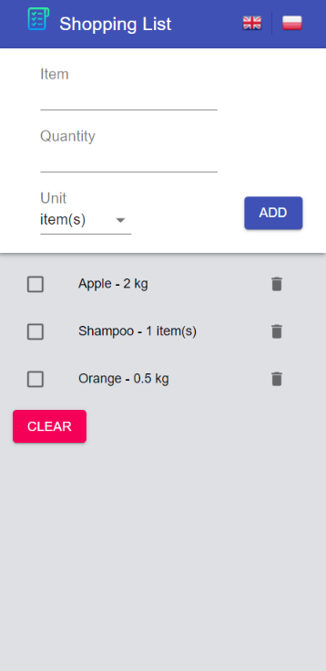
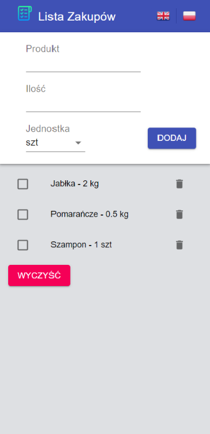

# 📜 Shopping List 🛒

##### Project is still in progress 👩‍🔧
* [General info](#general-info)
* [Source](#source)
* [Tech](#tech)
* [Setup](#setup)
* [Todos](#todos)


## General info

 This project was created to make my life easier.
 Shopping is not an easy job, especially when you send your boyfriend to pick it up.
 Then, in order to never forget anything, I decided to write an application that works in computer browsers and on mobile devices.


## Tech

 This project uses a number of open source projects to work properly:

* [Create React App](https://github.com/facebook/create-react-app)
* [Material-UI](https://material-ui.com/)
* [Sass](https://sass-lang.com/)
* [i18next](https://www.i18next.com) - for translations (EN, PL)

## Live Demo

  [🔍 DEMO](https://dominikaozorkiewicz.github.io/ShoppingList/)


## Setup
 To run this project, install it locally using npm:

 ```
 $ cd ../ShoppingList
 $ npm install
 $ npm start
 ```
Open [http://localhost:3000](http://localhost:3000) to view it in the browser.


## Todos

 - User accounts
 - Saving lists
 - Sharing list with someone
 

 ## Preview
 
 
 
 